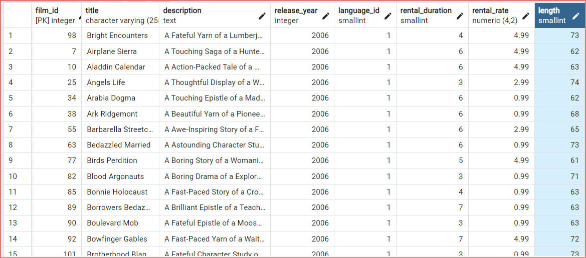
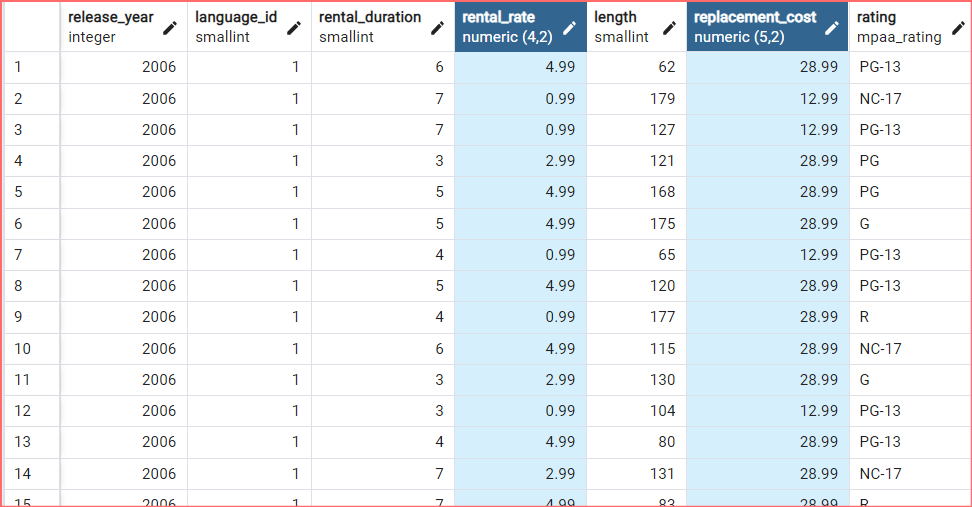
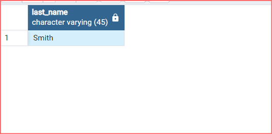
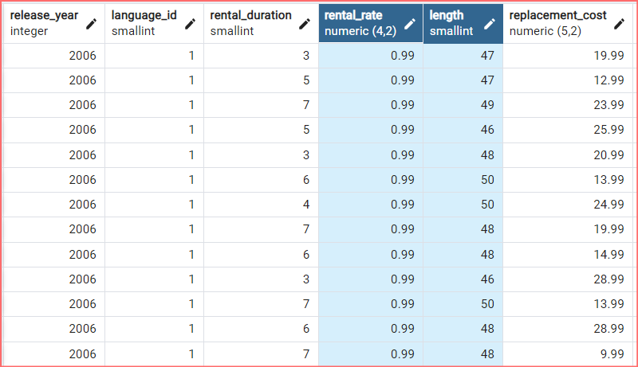
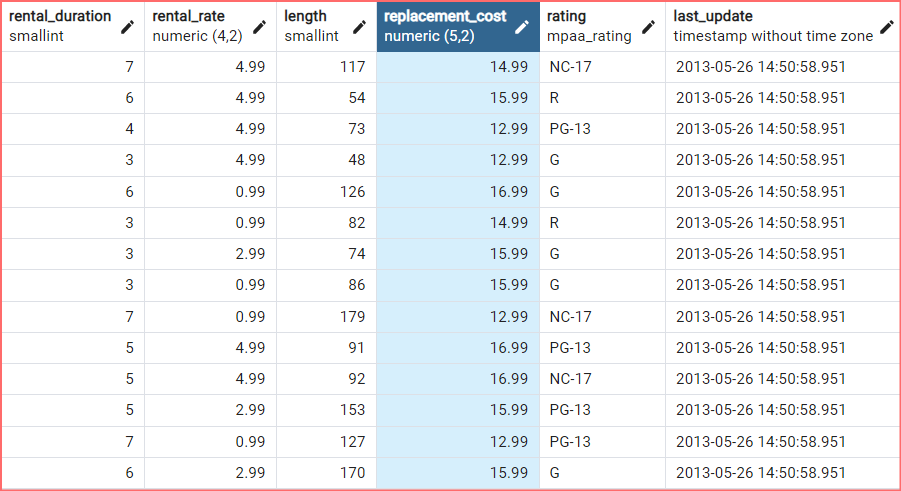
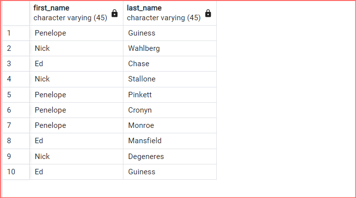
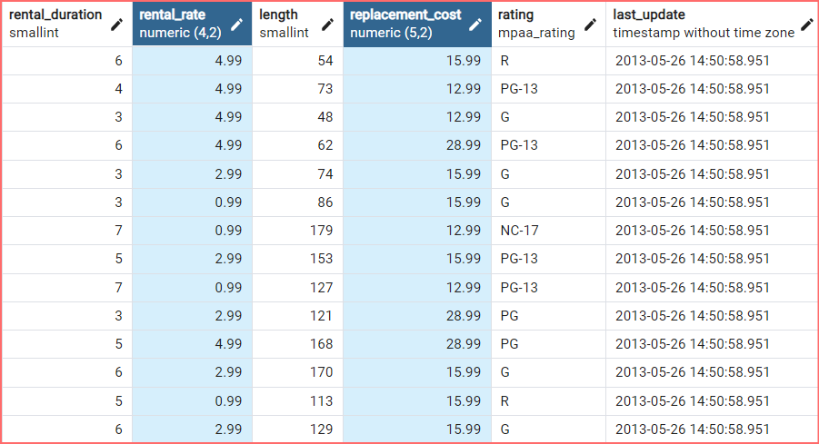

# 

## SQL Ödev 1 | WHERE ve Karşılaştırma & Mantıksal Operatörleri

<br>

1-) <strong>film </strong>tablosunda bulunan <strong>title</strong> ve <strong>description</strong> 
sütunlarındaki verileri sıralayınız.


```
SELECT title, description FROM film;
```


<br>

2-) <strong>film</strong>  tablosunda bulunan tüm sütunlardaki verileri film uzunluğu <strong>(length)</strong>  60 dan büyük <strong>VE</strong>  75 ten küçük olma koşullarıyla sıralayınız.


```
SELECT * FROM film
WHERE length > 60 AND length < 75;
```



<br>

3-)  <strong>film</strong> tablosunda bulunan tüm sütunlardaki verileri  <strong>rental_rate</strong> 0.99  <strong>VE</strong>  <strong>replacement_cost</strong> 12.99  <strong>VEYA</strong> 28.99 olma koşullarıyla sıralayınız.


```
SELECT * FROM film
WHERE rental_rate = 0.99 AND replacement_cost = 12.99 
OR replacement_cost = 28.99;
```



<br>

4-) <strong>customer</strong> tablosunda bulunan <strong>first_name</strong> sütunundaki değeri 'Mary' olan müşterinin <strong>last_name</strong> sütunundaki değeri nedir?


```
SELECT last_name FROM customer
WHERE first_name = 'Mary';
```



<br>

5-) <strong>film</strong>  tablosundaki <strong>uzunluğu(length)</strong>  50 ten büyük OLMAYIP aynı zamanda <strong>rental_rate</strong>  değeri 2.99 <strong>veya</strong>  4.99 OLMAYAN verileri sıralayınız.

```
SELECT * FROM film
WHERE length <= 50 
AND NOT (rental_rate = 2.99 OR rental_rate = 4.99);
```



<br>

## SQL Ödev 2 | BETWEEN ve IN

<br>    

1-) <strong>film</strong> tablosunda bulunan tüm sütunlardaki verileri <strong>replacement cost</strong> değeri 12.99 dan büyük eşit ve 16.99 küçük olma koşuluyla sıralayınız ( BETWEEN - AND yapısını kullanınız.)

```
SELECT * FROM film 
WHERE replacement_cost BETWEEN 12.99 AND 16.99;
```



<br> 

2-) <strong>actor</strong> tablosunda bulunan <strong>first_name</strong> ve <strong>last_name</strong> sütunlardaki verileri <strong>first_name</strong> 'Penelope' veya 'Nick' veya 'Ed' değerleri olması koşuluyla sıralayınız. ( IN operatörünü kullanınız.)

```
SELECT first_name, last_name FROM actor 
WHERE first_name IN ('Penelope', 'Nick', 'Ed');
```


<br>

3-) <strong>film</strong> tablosunda bulunan tüm sütunlardaki verileri <strong>rental_rate</strong> 0.99, 2.99, 4.99 VE <strong>replacement_cost</strong> 12.99, 15.99, 28.99 olma koşullarıyla sıralayınız. ( IN operatörünü kullanınız.)

```
SELECT first_name, last_name FROM actor 
WHERE first_name IN ('Penelope', 'Nick', 'Ed');
```


<br>

Bu repo [Patika](https://academy.patika.dev/) SQL eğitimindeki ödev reposu. İçerisinde bir adet README dosyası barındırıyor.

## Installation

Öncelikle projeyi clonelayın.

```
https://github.com/mucahidcanbey/sql_odevler_patika.git
```

## Usage

Projeyi cloneladıktan sonra Visual Studio Code programında açınız.

Linux için:

```
cd sql_odevler_patika
code .
```

## Contributing
Pull requestler kabul edilir. Büyük değişiklikler için, lütfen önce neyi değiştirmek istediğinizi tartışmak için bir konu açınız.

## License
[MIT](https://choosealicense.com/licenses/mit/)

