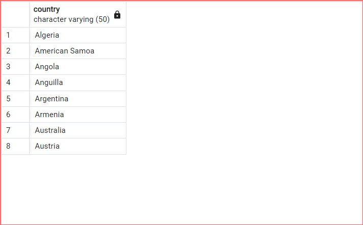
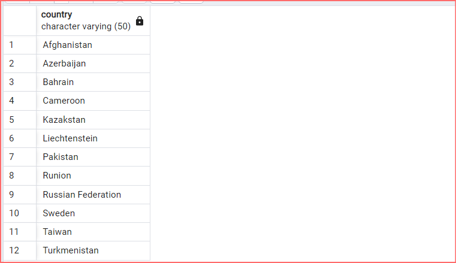
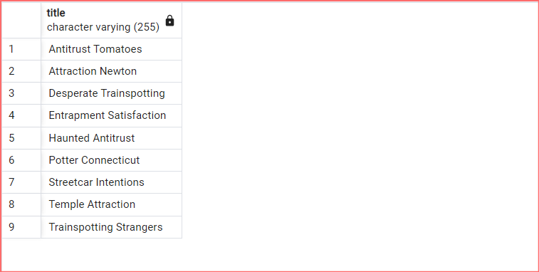
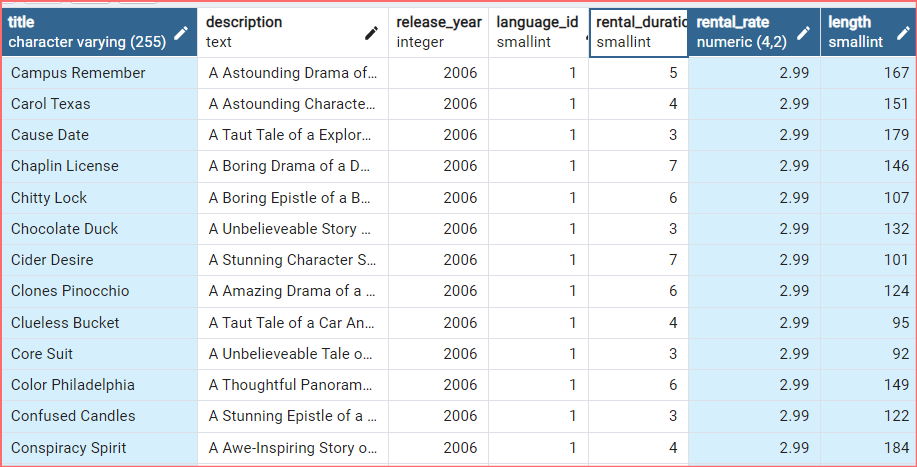
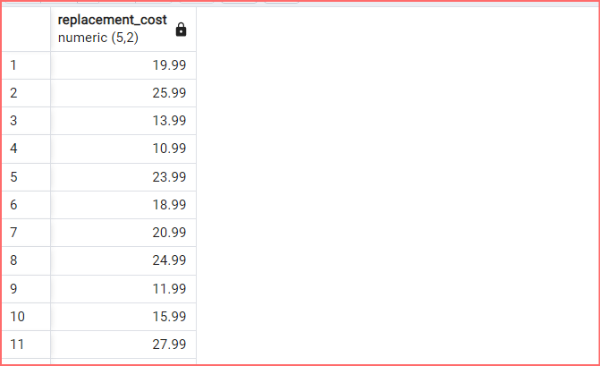
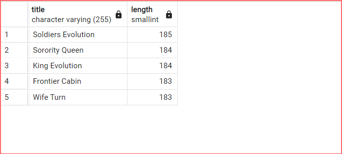
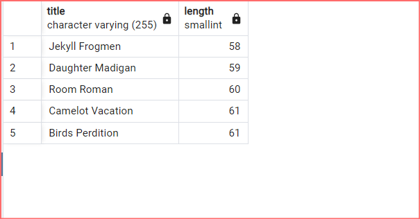
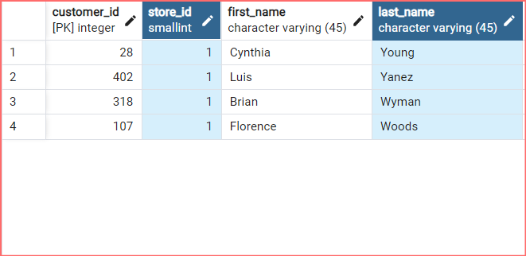

# 

## SQL Ödev 1 | WHERE ve Karşılaştırma & Mantıksal Operatörleri

<br>
<br>
<br>

1-) <strong>film </strong>tablosunda bulunan <strong>title</strong> ve <strong>description</strong> 
sütunlarındaki verileri sıralayınız.


```

SELECT title, description FROM film;

```


<br>
<br>
<br>

2-) <strong>film</strong>  tablosunda bulunan tüm sütunlardaki verileri film uzunluğu <strong>(length)</strong>  60 dan büyük <strong>VE</strong>  75 ten küçük olma koşullarıyla sıralayınız.


```

SELECT * FROM film
WHERE length > 60 AND length < 75;

```


<br>
<br>
<br>

3-)  <strong>film</strong> tablosunda bulunan tüm sütunlardaki verileri  <strong>rental_rate</strong> 0.99  <strong>VE</strong>  <strong>replacement_cost</strong> 12.99  <strong>VEYA</strong> 28.99 olma koşullarıyla sıralayınız.


```

SELECT * FROM film
WHERE rental_rate = 0.99 AND replacement_cost = 12.99 
OR replacement_cost = 28.99;

```


<br>
<br>
<br>

4-) <strong>customer</strong> tablosunda bulunan <strong>first_name</strong> sütunundaki değeri 'Mary' olan müşterinin <strong>last_name</strong> sütunundaki değeri nedir?


```

SELECT last_name FROM customer
WHERE first_name = 'Mary';

```


<br>
<br>
<br>

5-) <strong>film</strong>  tablosundaki <strong>uzunluğu(length)</strong>  50 ten büyük OLMAYIP aynı zamanda <strong>rental_rate</strong>  değeri 2.99 <strong>veya</strong>  4.99 OLMAYAN verileri sıralayınız.

```

SELECT * FROM film
WHERE length <= 50 
AND NOT (rental_rate = 2.99 OR rental_rate = 4.99);

```


<br>
<br>
<br>

## SQL Ödev 2 | BETWEEN ve IN

<br>
<br>    
<br>

1-) <strong>film</strong> tablosunda bulunan tüm sütunlardaki verileri <strong>replacement cost</strong> değeri 12.99 dan büyük eşit ve 16.99 küçük olma koşuluyla sıralayınız ( BETWEEN - AND yapısını kullanınız.)

```

SELECT * FROM film 
WHERE replacement_cost BETWEEN 12.99 AND 16.99;

```


<br> 
<br>
<br>

2-) <strong>actor</strong> tablosunda bulunan <strong>first_name</strong> ve <strong>last_name</strong> sütunlardaki verileri <strong>first_name</strong> 'Penelope' veya 'Nick' veya 'Ed' değerleri olması koşuluyla sıralayınız. ( IN operatörünü kullanınız.)

```

SELECT first_name, last_name FROM actor 
WHERE first_name IN ('Penelope', 'Nick', 'Ed');

```


<br>
<br>
<br>

3-) <strong>film</strong> tablosunda bulunan tüm sütunlardaki verileri <strong>rental_rate</strong> 0.99, 2.99, 4.99 VE <strong>replacement_cost</strong> 12.99, 15.99, 28.99 olma koşullarıyla sıralayınız. ( IN operatörünü kullanınız.)

```

SELECT first_name, last_name FROM actor 
WHERE first_name IN ('Penelope', 'Nick', 'Ed');

```


<br>
<br>
<br>

## SQL Ödev 3 | LIKE ve ILIKE

<br>
<br>
<br>

1-)  <strong>country</strong> tablosunda bulunan  <strong>country</strong> sütunundaki ülke isimlerinden 'A' karakteri ile başlayıp 'a' karakteri ile sonlananları sıralayınız.

```

SELECT country FROM country
WHERE country ~~ 'A%a' 

```



<br>
<br>
<br>

2-) <strong>country</strong> tablosunda bulunan <strong>country</strong> sütunundaki ülke isimlerinden en az 6 karakterden oluşan ve sonu 'n' karakteri ile sonlananları sıralayınız.

```

SELECT country FROM country 
WHERE country LIKE '_____%n' 

```




<br>
<br>
<br>

3-) <strong>film</strong> tablosunda bulunan <strong>title</strong> sütunundaki film isimlerinden en az 4 adet büyük ya da küçük harf farketmesizin <strong>'T'</strong> karakteri içeren film isimlerini sıralayınız.

```

SELECT title FROM film 
WHERE title ~~* '%T%T%T%T%' 

```


<br>
<br>
<br>

4-) <strong>film</strong> tablosunda bulunan tüm sütunlardaki verilerden <strong>title</strong> 'C' karakteri ile başlayan ve uzunluğu (length) 90 dan büyük olan ve <strong>rental_rate</strong> 2.99 olan verileri sıralayınız.

```

SELECT * FROM film 
WHERE title LIKE 'C%' AND length > 90 AND rental_rate = 2.99; 

```



<br>
<br>
<br>

## SQL Ödev 4 | DISTINCT ve COUNT

<br>
<br>
<br>

1-)  <strong>film</strong> tablosunda bulunan  <strong>replacement_cost</strong> sütununda bulunan birbirinden farklı değerleri sıralayınız.

```

SELECT DISTINCT replacement_cost FROM film

```


<br>
<br>
<br>

2-) <strong>film</strong> tablosunda bulunan <Strong>replacement_cost</strong> sütununda birbirinden farklı kaç tane veri vardır?

```

SELECT COUNT (DISTINCT replacement_cost) FROM film

```


<br>
<br>
<br>

3-) <strong>film</strong> tablosunda bulunan film isimlerinde  <strong>(title)</strong> kaç tanesini T karakteri ile başlar ve aynı zamanda  <strong>rating</strong> 'G' ye eşittir?

```

SELECT COUNT(*) FROM film 
WHERE title LIKE 'T%' AND rating = 'G';

```

<br>
<br>
<br>


4-) <strong>country</strong> tablosunda bulunan ülke isimlerinden (country) kaç tanesi <strong>5</strong> karakterden oluşmaktadır?


```

SELECT COUNT(DISTINCT country) FROM country 
where country like '_____';

```

<br>
<br>
<br>

5-) city tablosundaki şehir isimlerinin kaç tanesi 'R' veya r karakteri ile biter?

```

SELECT COUNT(city) FROM city 
WHERE city ILIKE 'R%'

```

<br>
<br>
<br>

## SQL Ödev 5 | ORDER BY | LIMIT ve OFFSET

<br>
<br>
<br>

1-) film tablosunda bulunan ve film ismi (title) 'n' karakteri ile biten en uzun (length) 5 filmi sıralayınız.

```

SELECT title, length
FROM film
WHERE title LIKE '%n'
ORDER BY length DESC
LIMIT 5;

```



<br>
<br>
<br>

2-) film tablosunda bulunan ve film ismi (title) 'n' karakteri ile biten en kısa (length) ikinci(6,7,8,9,10) 5 filmi(6,7,8,9,10) sıralayınız.


```

SELECT title, length
FROM film
WHERE title LIKE '%n'
ORDER BY length ASC
LIMIT 5 OFFSET 5;

```



<br>
<br>
<br>

3-) customer tablosunda bulunan last_name sütununa göre azalan yapılan sıralamada store_id 1 olmak koşuluyla ilk 4 veriyi sıralayınız.


```

SELECT *
FROM customer
WHERE store_id = 1
ORDER BY last_name DESC
LIMIT 4;

```



Bu repo [Patika](https://academy.patika.dev/) SQL eğitimindeki ödev reposu. İçerisinde bir adet README dosyası barındırıyor.

## Installation

Öncelikle projeyi clonelayın.

```
https://github.com/mucahidcanbey/sql_odevler_patika.git
```

## Usage

Projeyi cloneladıktan sonra Visual Studio Code programında açınız.

Linux için:

```
cd sql_odevler_patika
code .
```

## Contributing
Pull requestler kabul edilir. Büyük değişiklikler için, lütfen önce neyi değiştirmek istediğinizi tartışmak için bir konu açınız.

## License
[MIT](https://choosealicense.com/licenses/mit/)

